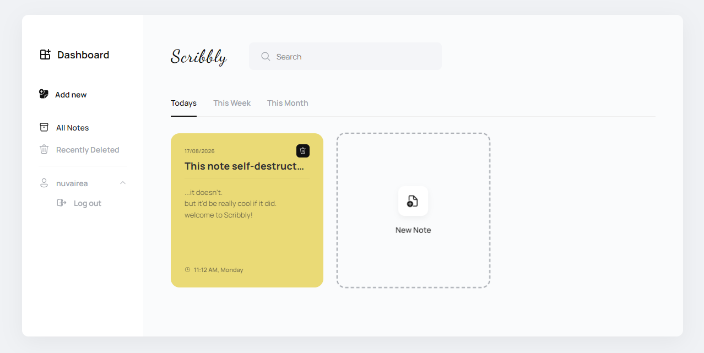
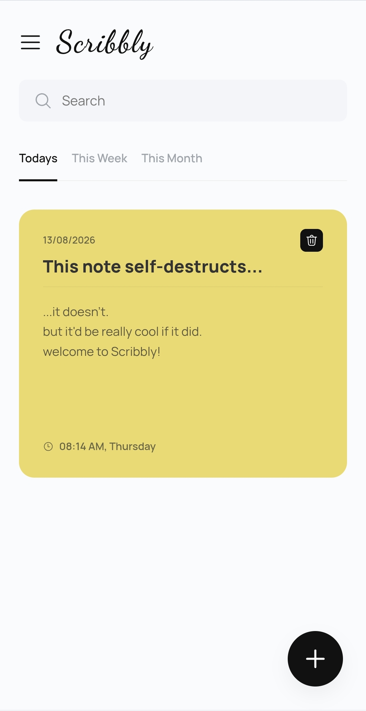

# Scribbly

A quick, clean note-taking app. Write, tag with a color, done.

<p align="center">
  
</p>
<p align="center">
  
  
</p>

**Live app:** [scribbly-app.onrender.com](https://scribbly-app.onrender.com)

## Features

- Create, edit, and color-tag notes
- Search across all notes
- Filter by Today, This Week, or This Month
- Soft-delete with a Recently Deleted view
- Sign up, log in, or continue as a guest
- Notes sync automatically when logged in, with offline support and automatic retry if a save fails
- Installable as a PWA, works offline
- Light/dark theme, follows your system preference

## Tech stack

- Vanilla JavaScript (ES modules)
- CSS custom properties for theming
- Service worker for offline app-shell caching
- `fetch` + session-cookie auth against the Scribbly server (see below)

## Getting started

No build tooling required, it's plain HTML/CSS/JS.

```bash
git clone https://github.com/nuvairea/scribbly.git
cd scribbly
```

Serve it with any static server, for example:

```bash
npx live-server
# or
python3 -m http.server 5500
```

Then open it in your browser. The app talks to the live Scribbly server by default. See the backend repo below if you want to run your own instance.

## Project structure

```
scribbly/
├── index.html
├── manifest.json
├── sw.js
├── style.css
├── scripts/
│   ├── main.js       # app entry point, event wiring
│   ├── auth.js       # login/signup/logout API calls
│   ├── notes.js      # note CRUD + local/server sync
│   └── ui.js         # rendering
└── assets/
```

## Backend

Scribbly's API is a separate service. Node.js/Express with session-based auth (bcrypt + `express-session`) and MongoDB for storage.

**Server repo:** [Scribbly Server](https://github.com/nuvairea/scribbly-server)