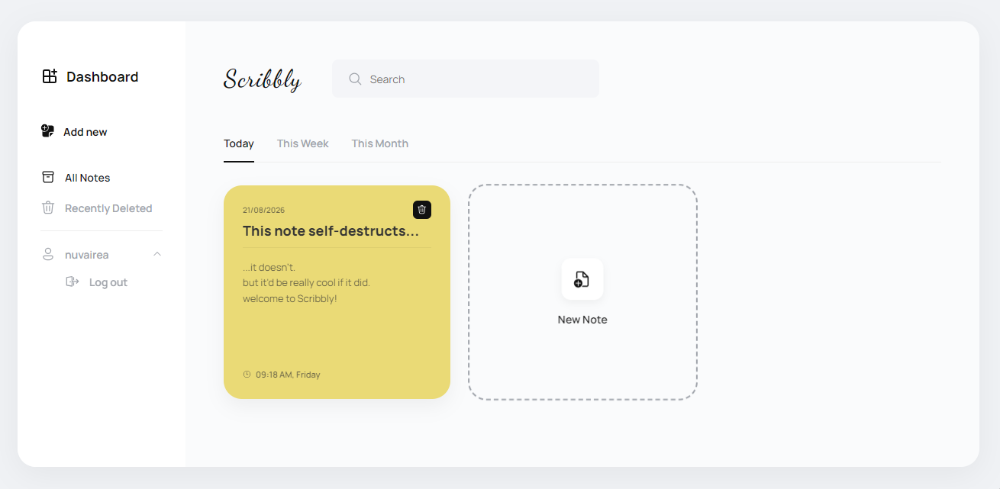
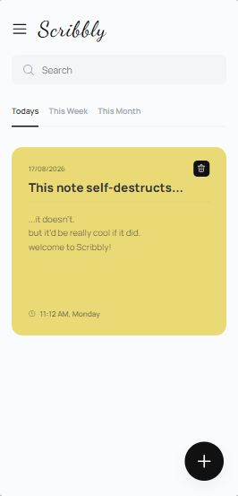
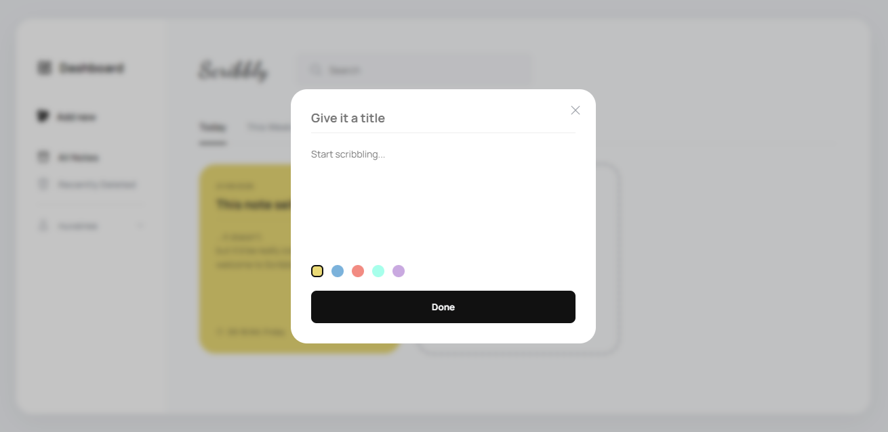
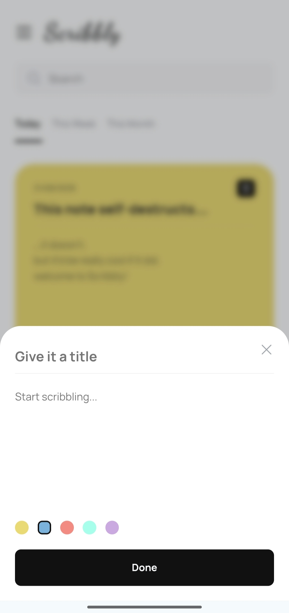

# Scribbly

> Quick, clean note taking for the web.

[](https://scribbly-app.onrender.com)
[](https://developer.mozilla.org/en-US/docs/Web/JavaScript)
[](https://web.dev/progressive-web-apps/)

Scribbly is a focused note-taking app with fast local editing, searchable notes, color tags, and optional account-based sync. It works as a responsive web app and an installable Progressive Web App.

## Preview

<table>
  <tr>
    <th align="left" width="78%">Desktop dashboard</th>
    <th align="left" width="22%">Mobile dashboard</th>
  </tr>
  <tr>
    <td width="78%"></td>
    <td width="22%"></td>
  </tr>
  <tr>
    <th align="left" width="78%">Desktop note editor</th>
    <th align="left" width="22%">Mobile note editor</th>
  </tr>
  <tr>
    <td width="78%"></td>
    <td width="22%"></td>
  </tr>
</table>

## Features

- Create, edit, and color-tag notes
- Search across all notes
- Filter notes by today, this week, or this month
- Soft-delete notes and recover them from Recently Deleted
- Sign up, log in, or continue as a guest
- Sync notes automatically when logged in
- Continue working offline with automatic retry when a save fails
- Install the app as a PWA for offline app-shell access
- Switch between light and dark themes, or follow the system preference

## Built with

- Vanilla JavaScript using ES modules
- HTML and CSS custom properties for responsive theming
- A service worker for offline app-shell caching
- `fetch` and session-cookie authentication

## Getting started

Scribbly is a static frontend with no build step.

```bash
git clone https://github.com/nuvairea/scribbly.git
cd scribbly
```

Serve the directory with any static server:

```bash
npx live-server
# or
python3 -m http.server 5500
```

Then open the local URL shown by the server. By default, the app connects to the deployed Scribbly API. To run the complete stack locally, use the backend project linked below.

## Project structure

```text
scribbly/
├── index.html
├── manifest.json
├── sw.js
├── style.css
├── scripts/
│   ├── main.js      # application entry point and event wiring
│   ├── auth.js      # authentication API calls
│   ├── notes.js     # note CRUD and sync logic
│   └── ui.js        # rendering and UI updates
└── assets/
    └── screenshots/
```

## Backend

The API is maintained in a separate Node.js and Express service. It uses session-based authentication with bcrypt and `express-session`, and MongoDB for persistence.

See the [Scribbly Server repository](https://github.com/nuvairea/scribbly-server)